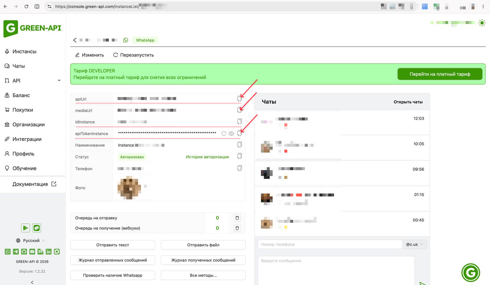

# GRAPI — чат-клиент на базе GREEN-API (WhatsApp)

Веб-приложение-мессенджер в стиле WhatsApp Web для отправки и получения **текстовых** сообщений через сервис [GREEN-API](https://green-api.com).

## Демо

Рабочее демо приложения развёрнуто на Vercel:

[https://grapi-mess.vercel.app/](https://grapi-mess.vercel.app/)

## Возможности

- Вход по учётным данным инстанса GREEN-API (`idInstance`, `apiTokenInstance`, `apiUrl`) с проверкой на сервере
- Создание нового чата по номеру телефона (проверка номера через `checkWhatsapp`)
- Отправка текстовых сообщений методом `SendMessage`
- Получение входящих сообщений по технологии HTTP API (поллинг очереди уведомлений `receiveNotification` / `deleteNotification`)
- Список чатов с превью последнего сообщения и счётчиком непрочитанных
- Черновики сообщений по каждому чату (сохраняются между сессиями)
- Баннер о недоступности интернета
- Адаптивная вёрстка (на мобильных сайдбар сворачивается)

## Требования

- Node.js **20.9+** (рекомендуется 22 LTS)
- npm

## Установка

```bash
npm install
```

## Запуск в режиме разработки

```bash
npm run dev
```

Открой [http://localhost:3000](http://localhost:3000).

## Скрипты

| Команда | Описание |
|---|---|
| `npm run dev` | Запуск dev-сервера |
| `npm run build` | Продакшен-сборка |
| `npm run start` | Запуск продакшен-сборки |
| `npm run lint` | Проверка линтером (ESLint) |
| `npm run typecheck` | Проверка типов (tsc --noEmit) |

## Настройка

### Учётные данные

Для работы приложения нужен инстанс WhatsApp в [кабинете GREEN-API](https://console.green-api.com).

- [Регистрация в Личном кабинете](https://green-api.com/docs/before-start/#cabinet)
- [Создание и авторизация инстанса](https://green-api.com/docs/before-start/#instance)


Данные для входа:

- `idInstance` — идентификатор инстанса (например `1101000001`)
- `apiTokenInstance` — токен инстанса
- `apiUrl` — адрес API (домен, указанный в настройках инстанса)

 


 Чтобы получать входящие уведомления о входящих сообщениях, необходимо включить настройки в инстансе:

- [Получать уведомления о входящих сообщениях и файлах](https://green-api.com/docs/api/receiving/notifications-format/incoming-message/TextMessage/#:~:text=typeMessage%20%3D%20textMessage-,%D0%9D%D0%B0%D1%81%D1%82%D1%80%D0%BE%D0%B9%D0%BA%D0%B0,-%D0%B8%D0%BD%D1%81%D1%82%D0%B0%D0%BD%D1%81%D0%B0)

>#
> ### Настройки применяются в течение 5 минут!
> 


>#### Если чат загрузился без данных о собеседнике (нет Имени, Фото)
>просто удалите чат и зосздайте снова.

## Как пользоваться

1. Запусти приложение и введи учётные данные GREEN-API → «Войти»
2. Нажми **«+»** в шапке списка чатов → введи номер собеседника → «Создать»
3. Выбери чат и напиши сообщение (Enter — отправить, Shift+Enter — перенос строки)
4. Ответы собеседника появляются в чате автоматически

## Технологии

- [Next.js](https://nextjs.org) 16 (App Router)
- [React](https://react.dev) 19
- [TypeScript](https://www.typescriptlang.org)
- [Zustand](https://github.com/pmndrs/zustand) + persist (localStorage)
- CSS Modules

## Структура проекта

Проект организован по методологии Feature-Sliced Design (упрощённо):

```
src/
├── app/                  # Страницы и серверные роуты
│   ├── api/green-api/    # Прокси запросов к GREEN-API (обход CORS)
│   └── page.tsx          # Главная страница (вход / чат)
├── entities/
│   ├── chat/             # Модель чата: типы, zustand-стор
│   └── message/          # Модель сообщения: типы, пузырь сообщения
├── features/
│   ├── connect-instance/ # Экран входа и проверка учётных данных
│   ├── receive-messages/ # Поллинг входящих сообщений
│   ├── send-message/     # Отправка сообщений и поле ввода
│   └── start-chat/       # Создание нового чата
├── shared/
│   ├── api/              # Клиент GREEN-API
│   ├── config/           # Константы
│   └── lib/              # Утилиты и хуки
└── widgets/
    ├── chat-list/        # Список чатов
    ├── chat-window/      # Окно диалога
    └── offline-banner/   # Баннер оффлайн
```

## Особенности реализации

- **Прокси CORS.** Запросы к GREEN-API идут через серверный роут `/api/green-api`: WAF перед GREEN-API не отдаёт CORS-заголовки на ответы об ошибках (401/404), из-за чего браузер превращал их в `Failed to fetch`. Прокси возвращает реальные HTTP-статусы, поэтому приложение корректно показывает ошибки входа («Неверные учётные данные», «Инстанс не найден» и т.д.).
- **Поллинг очереди.** Входящие сообщения читаются через `receiveNotification`, после обработки уведомление обязательно удаляется (`deleteNotification`), иначе оно блокирует очередь.
- **Хранение данных.** Чаты, черновики и учётные данные сохраняются в localStorage (zustand persist). История сообщений хранится локально.
